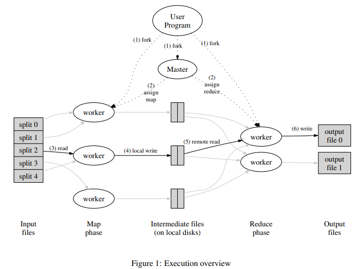

# LEC1 Introduction

### 1. 分布式系统介绍

**什么是分布式系统**

分布式系统是协作提供服务的一组计算机，通常用来提供基础设施服务，包括大型网站建设，实现 MapReduce 系统，点对点共享。许多重要的架构都是分布式的。

**为什么我们要使用分布式系统**

- 通过并行处理提升系统容量
- 通过复制容忍错误
- 匹配物理设备的分布（如传感器）
- 通过隔离实现安全

**分布式系统的困难**

- 许多的组成部分和复杂的交互
- 应对系统中的部分错误
- 应对潜在的性能问题

**主要的课题**

这是一项关于应用程序架构的课程

- 存储
- 通信
- 计算

关键在于我们需要对外界**隐藏应用程序因分布式部署带来的复杂性**

**课题：容错**

数以千计的服务器和其间的复杂网络经常会发生错误。我们希望在应用程序的外在表现上隐藏这些错误，即实现**高可用**。例如一个服务器崩溃，系统可以通过其他服务器继续工作。

在 lab2 和 lab3 中我们会尝试。

**课题：一致性**

要实现通用的基础设施，需要良好定义系统中具体的状态。

例如当我们进行`get(key)`操作时，是否应该获得最近的`put(key,value)`中插入的值。

实现好的状态是困难的。例如我们的服务器之间有**复制**操作时，就很难实现一致性。

**课题：性能表现**

目标是获得一个**可伸缩的吞吐量 scalable throughtput**

我们的服务器越多，越难以实现：

- 均衡的负载。
- 小于 N 倍的延迟。
- 随着服务器数量增加得到有效的性能提升（例如初始化、交互）

在 lab1 和 lab4 中我们会尝试。

**课题：折衷**

容错、一致性和性能之间我们往往要进行一定的折衷。

容错和一致性处理需要各个节点进行通信：

- 发送数据进行后备存储。
- 检查自身数据是否为最新。

而通信往往是缓慢切不可扩展的。

许多设计仅仅提供了**弱一致性**来获取较好的性能。这对程序员来说可能是痛苦的，因为他获取的数据往往不是最新最正确的，但却是系统实现上一种好的权衡。

**课题：实现**

如 RPC、多线程、并发控制等等


### 2. MapReduce

**MapReduce 概述**

- **上下文：**超大数据集的实时并行计算。例如简历索引、排序、分析网络结构等等。仅仅在大规模计算机集群上有效
- **总体目标：**让零经验的程序员也能轻易使用，它们只需要定义`map`函数和`reduce`函数。

**MapReduce 任务的一个抽象视图：字数统计**

```
Input1 -> Map -> a,1 b,1
Input2 -> Map ->     b,1
Input3 -> Map -> a,1  |  c,1
                  |   |   |
                  |   |   -> Reduce -> c,1
                  |   -----> Reduce -> b,2
                  ---------> Reduce -> a,2
```

- 输入被分为 $M$ 个文件。

- MapReduce 对每个输入文件调用`map()`函数，生成中间键值对。
  - 每个`map()`函数调用成为一个**任务**。
- 当`map()`执行完毕，MapReduce 会聚合所有拥有相同 key 的 value。
- 利用中间键值对的 Key 和其 value 的集合，调用`reduce()`函数。

```go
Word-count-specific code
  Map(k, v)
    split v into words
    for each word w
      emit(w, "1")
  Reduce(k, v_set)
    emit(len(v_set))
```

**MapReduce 有很好的可扩展性**

N 个 Worker 可以获得 Nx 倍的吞吐量。`map()`函数可以并行运行，因为他们互不干扰。

`reduce`同理。

**MapReduce 隐藏了许多实现上的细节**

- 向服务器发送应用程序代码
- 跟踪哪些任务已经完成
- 在 map 和 reduce 之间重拍中间键值对
- 失败回复

**MapReduce 也对应用程序有一些限制**

- 除了中间输出，没有交互或者状态
- 没有迭代
- 没有实时处理或流处理

**MapReduce 的输入输出存储在 GFS 集群文件系统上**

MapReduce 需要很大的并行输入输出吞吐量。

GFS 将文件分散到多个服务器上，以大小为 64MB 的块为单位存储。输入输出并行地对这些块进行读写。

GFS 也会将一个文件分割成多个部分，存储到两个或三个服务器上。

GFS 非常适合与 MapReduce 协同工作。

**关于下图的一些细节：**



一个协调者 Master 会将任务分发给 Workers，并记录下他们的工作进度。

- 协调者将`map`任务分发给 Workers。
  - `map`任务将输出写到本地的磁盘上。
  - `map`任务将输出哈希为 R 个，供每个`reduce`任务使用。
- 所有`map`任务完成后，协调者将分发`reduce`任务。
  - 每个`reduce`任务从 map Worker 的本地磁盘上获取中间输出。
  - 每个`reduce`任务在 GFS 上写一个单独的输出文件。

