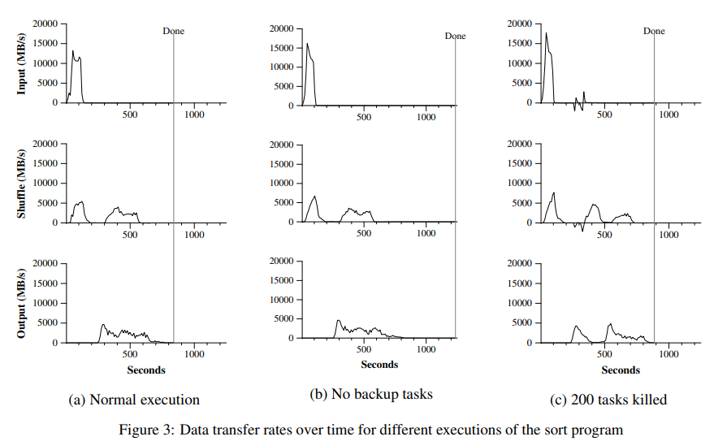

# MapReduce: Simplified Data Processing on Large Clusters

> 英文原文：[MapReduce: Simplified Data Processing on Large Clusters](G:\代码学习资料\书\论文\MapReduce-Simplified Data Processing on Large Clusters.pdf)
>
> 参考翻译：https://zhuanlan.zhihu.com/p/141657364

### 概述

MapReduce 是一种编程模型，用于处理和生成大型数据集的相应实现。用户定义一个`map`函数以处理 key-value 键值对，生成中间态的 key-value 键值对。还要定义一个`reduce`函数来合并所有有相同中间态 key 的所有中间态 value。许多现实世界的工作都可以用这个模型实现。

**以此风格编写的程序可以自动并行化地在大型商用机器集群上运行，运行时系统负责以下任务：**

- 对输入数据进行分区
- 调度程序在一组机器上的运行
- 处理机器故障
- 管理所需的机器间通信

这令没有任何经验的程序员也可以设计出大型的分布式系统。


### 1. MapReduce介绍

为了应对并行计算的复杂性，我们设计了一种新的抽象，它允许我们表达我们试图执行的简单计算，并且在库函数中隐藏了并行化、容错、数据分布和负载均衡的繁琐细节。

我们的大多数计算都涉及下面两个操作

- map 操作：将输入中的每个逻辑记录映射为一个 key-value 对。
- reduce 操作：对所有的中间 key-value 对进行操作，生成派生数据。

MapReduce 是一个简单强大的接口，在大型商用集群上我们需要对这个接口做高性能的实现。


### 2. 编程模型

**MapReduce 编程模型的原理**是：利用一个输入的 key-value 键值对集合产生一个输出的 key-value 键值对集合。

用户自定义的 map 函数接受一个 key-value 键值对的输入值，然后产生一个中间 key-value 键值对的集合。MapReduce 库把所有具有相同中间态 key 的中间态 key-vlaue 对进行合并，传递给一个 reduce 函数。

用户自定义的 reduce 函数接受一个中间态的 key，以及与之关联的 value 集合。通常来说每次 reduce 只产生 0 个或 1 个输出 value 值。**通常我们通过一个迭代器把中间 value 值提供给 reduce 函数**，这样就可以处理无法放入内存的大量的 value 值的集合。

#### 2.1 一个示例

思考一个问题，在大文档集合中统计每个单词出现的次数，我们依照 MapReduce 模型可能会写出下面的伪代码：

```go
// key: document name | value: document contents 
map(String key, String value):
for each word w in value:
  EmitIntermediate(w, “1″); 

// key: a word | values: a list of counts 
reduce(String key, Iterator values): 
int result = 0; 
for each v in values: 
  result += ParseInt(v); 
Emit(AsString(result));
```

map 函数输出文档中的每个词、以及这个词的出现次数（在这个简单的例子里就是 1）。reduce 函数把 map 函数产生的每一个特定的词的计数累加起来。

用户需要编写应用代码，使用输入和输出文件的名字、可选的调节参数来完成一个符合 MapReduce 模型规范的对象。然后调用 MapReduce 函数，并把这个规范对象传递给它。用户的代码和 MapReduce 库会自动链接在一起。

#### 2.2 输入输出类型信息

在前面的伪代码示例中，使用字符串处理输入输出。但实际上用户定义的 map 和 reduce 函数都有相关联的类型。

```
map     (k1,v1)       ->list(k2,v2) 
reduce  (k2,list(v2)) ->list(v2)
```

例如，在 map 函数中，输入的 key 和 value 与输出的 key 和 value 可能由不同的类型推导出来。而在 reduce 函数中，中间 key-value 键值对与输出 key-value 键值对由相同的类型推导出来。

本文中的 cpp 实现将字符串作为用户定义函数的输入输出，类型转换留在用户代码中进行处理。

#### 2.3 适用场景

下面是一些用 MapReduce 模型表示的简单例子：

- **分布式 Grep。**map 函数输出匹配某个模式的一行，reduce 函数是一个恒等函数，即将中间数据复制到输出。
- **计算 URL 访问频率。**map 函数处理日志中 web 页面请求的记录，然后输出（URL，1）。reduce 函数把相同 URL 的 value 值累加起来，产生（URL，记录总数）作为返回结果。
- **倒转网络链接图。**map 函数在源页面 source 中搜索所有的链接目标 target，并输出为 (target，source)。reduce 函数把给定链接目标 (target) 的链接组合成一个列表，输出 (target，list(source))。
- **分布式排序。**map 函数从每个记录提取 key，输出 (key, record)，reduce 函数不改变任何值。这个运算依赖**分区机制**（4.1 节中描述）和**排序属性**（4.2 节中描述）。


### 3. 实现

MapReduce 可以有多种不同的实现方式，如何选择取决于实际环境。

- 一些实现方式适用于小型的共享内存方式的机器。
- 一些实现方式适用于大型 NUMA 架构的多处理器主机。
- 一些实现方式更适合大型的网络连接集群。

本章节描述一个 google 内部广泛使用的运算环境下的实现：用以太网交换机连接、由普通 PC 机组成的大型集群，它有以下基本属性：

- x86 架构、运行 Linux 操作系统、双处理器、2-4GB 内存的机器。
- 普通的网络硬件设备，每个机器的带宽为百兆或者千兆，但是远小于网络的平均带宽的一半。
- 集群中包含成百上千的机器，因此，机器故障是常态。
- 存储为廉价的内置 IDE 硬盘。一个内部分布式文件系统用来管理存储在这些磁盘上的数据。文件系统通过数据复制来在不可靠的硬件上保证数据的可靠性和有效性。
- 用户提交工作（job）给调度系统。每个工作（job）都包含一系列的任务（task），调度系统将这些任务调度到集群中多台可用的机器上。

#### 3.1 执行概况

通过将 map 调用的输入数据自动分割为 M 个数据片段的集合，map 调用被分布到多台机器上执行。输入的数据片段能够在不同的机器上并行处理。

使用分区函数将 map 调用产生的中间 key-value 键值对分成 R 个不同的分区。（例如`hash(key) mod R`），reduce 调用也被分布到多台机器上执行。分区数量 R 和分区函数由用户指定。


**Figure 1 展示了 MapReduce 视线中操作的全部流程。当用户调用 MapReduce 时，将发生下面一系列操作：（序号和 Figure1 中的序号一一对应）**

1. 用户程序首先调用的 MapReduce 库将输入文件分成 M 个数据片段，每个数据片段的大小一般从 16MB 到 64MB（可以通过可选的参数来控制每个数据片段的大小）。然后用户程序在集群中创建（fork）大量的程序副本。
2. 这些程序副本中有一个特殊的程序 Master，其他的程序都是 Worker。整个系统由 Master 分配任务。有 M 个 map 任务和 R 个 reduce 任务待分配。Master 将一个 map 任务或一个 reduce 任务分配给一个空闲的 Worker。
3. 被分配了 map 任务的 Worker 读取相关的输入数据片段，从输入的数据片段中读取 key-value 键值对。然后把 key-value 键值对传递给用户自定义的 map 函数，由 map 函数生成并输出中间 key-value 键值对，并缓存在内存中。
4. 缓存中的 key-value 键值对通过分区函数分为 R 个区域，周期性地写入到磁盘上。缓存的 key-value 键值对在本地磁盘上的存储位置将被回传给 Master，由 Master 负责将这些存储位置告诉 reduce Worker。
5. 当 reduce Worker 接收到 Master 发来的数据存储位置信息后，使用 RPC 从 map Worker 所在的主机的磁盘上读取这些缓存数据。当 reduce Worker 读取了所有的中间数据后，通过对 key 进行排序，使有相同 key 值的数据聚合在一起。由于许多不同的 key 会映射到相同的 reduce 上，因此必须进行排序。如果中间数据太大无法在内存中完成排序，那么就要进行外排序。
6. reduce Worker 程序遍历排序后的中间 key-value 键值对，对于每一个唯一的 key，Worker 将这个 key 和与它相关的中间 value 值的集合传递给用户自定义的 reduce 函数。reduce 函数的输出被追加到所属分区的输出文件。
7. 当所有的 map 和 reduce 任务完成后，Master 唤醒用户程序，这个时候在用户程序对 MapReduce 的调用才返回。

任务完成后，MapReduce 的输出存放在 R 个输出文件中，即每个 reduce 任务完成一个输出文件。一般情况下用户不需要将这些文件合并成一个文件，他们通常将这些文件作为另一个 MapReduce 的输入，或者在另一个可以处理多个分割文件的分布式应用中使用。

#### 3.2 Master数据结构

**Master 持有一些数据结构，存储每一个 map 和 reduce 任务的状态（空闲、工作中、完成），以及 Worker 机器的标识。**

**Master 就像一个数据管道**，中间文件存储区域的位置信息通过这个管道从 map 传递到 reduce。因此，对于每个已完成的 map 任务，Master 存储了 map 任务产生的 R 个中间文件存储区域的大小和位置。当 map 任务完成时，Master 接收到位置和大小的更新信息，这些信息被逐步递增的推送给那些正在工作的 reduce 任务。

#### 3.3 容错机制

MapReduce 需要有处理集群中机器故障的能力。

##### 3.3.1 Worker 错误

Master 会周期性地 ping 每个 Worker。如果在约定的时间范围内没有收到 Worker 返回的信息，那么 Master 会将这个 Worker 标记为失效。

- 所有由这个失效的 Worker 完成的完成的 map 任务会被重设为初始地空闲状态，这些任务就会被重新安排给其他的 Worker。
- Worker 失效时正在执行的 map 或 reduce 任务也会被重新置为空闲状态，等待重新调度。

当 Worker 故障时，由于已经完成的 map 任务的输出存储在这台机器上，map 任务的输出已经不可访问，所以必须重新执行。而已经完成的 reduce 任务的输出文件存储在全局文件系统上，不需要再次执行。

当一个 map 任务首先被 Worker A 执行，之后由于 Worker A 失效了又被调度到 worker B 执行，这个**重新执行**的任务会被通知给所有执行 reduce 任务的 Worker，任何还没有从 Worker A 读取数据的 reduce 任务会从 Worker B 读取数据。

MapReduce 可以处理大规模 Worker 失效的情况。比如 MapReduce 操作执行期间，有大面积的机器因网络维护等原因不可用，MapReduce Master 只需要简单地再次执行那些不可访问的 Worker 完成的工作，之后继续执行未完成的任务即可。最终就可以完成这个 MapReduce 操作。

##### 3.3.2 Master 错误

Master 错误的一个简单的解决办法是让 Master 周期性地将 3.2 节中描述的数据结构写入磁盘，并保存一个**检查点 checkpoint**。如果这个 Master 任务失效，可以从最后一个检查点开始启动另一个 Master 进程。 

但是考虑到只有一个 Master 服务器，Master 失效后再恢复是比较麻烦的，因此我们在这里的实现是如果 Master 失效，就中止 MapReduce 运算。客户端可以检查到这个状态，也可以根据需要重新执行 MapReduce 操作。

##### 3.3.3 出现故障时的重做语义

当用户提供的 map 和 reduce 操作是确定函数（即输入相同时一定产生相同输出）时，我们的分布式实现在任何情况下的输出都是一致的，无论是顺序还是所谓的乱序。

**我们依赖 map 和 reduce 任务的输出是原子的提交来完成这个特性。**每个工作中的 Worker 都会把它的输出写入到私有的临时文件中。每个 reduce 任务会生成这样一个文件，而每个 map 任务则会生成 R 个这样的文件（一个 reduce 任务对应一个文件）。

- 当一个 map 任务完成时， Worker 发送一个包含 R 个临时文件名的完成消息给 Master，如果 Master 从一个已经完成的 map 任务再次接受到一个完成消息，Master 将忽略这个消息；否则 Master 会把这 R 个文件的名字记录在数据结构里。
- 当一个 reduce 任务完成时，reduce Worker 进程以原子的方式把临时文件重命名为最终的输出文件。如果一个 reduce 任务在多台机器上执行，针对同一个最终的输出文件将有多个重命名操作执行。我们依赖底层文件系统提供的重命名操作的原子性来保证最终的文件系统仅仅包含一个 reduce 任务产生的数据。

实际上，我们绝大多数的 map 操作和 reduce 操作都是确定性的，并且存在这样一个事实：**我们的失效处理机制的结果等价于一个顺序的执行操作。**这使得程序员可以很轻易地推断出他们的 MapReduce 程序最后呈现的结果。

**当 map 或 reduce 操作不是确定性的函数时，我们提供虽然较弱但依然合理的处理机制。**当使用非确定操作的时候，一个 reduce 任务 R1 的输出等价于一个 R1 连续执行时产生的输出。但另一个 reduce 任务 R2 的输出也许等价于一个 R2 以另一个顺序连续执行时的输出。

考虑 map 任务 M 和 reduce 任务 R1、R2。我们设定 $e(R_i)$ 是 $R_i$ 已经提交的执行过程。当 $e(R_1)$ 读取了由 M 一次执行产生的输出，而 $e(R_2)$读取了由 M 的另一次执行产生的输出，较弱的失效处理语义就可能发生。

#### 3.4 数据存储位置（数据本地优化策略）

在我们部署 MapReduce 集群的运行环境中，网络带宽是相当匮乏的资源。**我们通过尽量把输入数据（由 GFS 管理）存储在集群中机器的本地磁盘上来节省网络带宽。**

GFS 把每个文件按 64MB 一个 Block 来分隔，每个 Block 保存在多台机器上，环境中就存放了多份拷贝（一般是三个）。MapReduce 的 Master 在调度 map 任务时就会考虑输入文件的位置信息，尽量将一个 map 任务调度在包含相关输入数据拷贝的机器上执行。

如果上述努力失败了，Master 将尝试在保存有输入数据拷贝的机器附近的机器上执行 map 任务，比如一个 switch 内的两个 Worker。**当在一个足够大的 cluster 集群上执行大型 MapReduce 操作时，大部分的输入数据都能从本地机器读取，因此消耗很小的网络带宽。**

#### 3.5 任务粒度和M、R的取值

如前所述，我们把 map 拆分为了 M 个片段，把 reduce 拆分为 R 个片段执行。**理想状态下 M 和 R 应当比集群中 Worker 的机器数量要多得多。**在每台 Worker 都执行大量不同任务能够提高集群的动态负载均衡能力，并且加快故障恢复的速度（失效机器上的大量 map 任务都可以分不到所有其他的 Worker 上执行）。

但是事实上，我们的具体实现中对 M 和 R 的取值都有一定的客观限制，因为 Master 必须执行 O(M+R) 次调度，并且在内存中保存 O(M*R) 个状态。

**更进一步，R 值通常由用户指定，因为每个 reduce 任务最终都会生成一个独立的输出文件。实际使用时我们也倾向于选择合适的 M 值，以使得每个独立任务都是处理大约 16M 到 64M 的输入数据，这样上面的数据本地存储优化策略才最有效。**

**另外，我们把 R 值设置为我们想使用的 Worker 机器的数量的小的倍数。**

在 Google 的实践中，往往有这样的组合：M = 2000，R = 5000，并有 2000 台 Worker。

#### 3.6 任务备份进程

在生产环境中，影响一个 MapReduce 总执行时间的重要因素通常是**落伍者**，即那些最后花了很长时间才完成的 map 和 reduce 任务，他们往往是导致 MapReduce 操作总执行时间超过预期的决定性因素。

出现落伍者的原因非常多，比如：

- 如果一个机器硬盘出问题，读取数据速度大大降低。
- 如果 cluster 的调度系统在一台机器上调度了其他任务。
- 由于 CPU、硬盘、网络等各种客观因素。
- 代码上有 bug，导致缓存失效等问题。

我们有一个通用的机制来减少落伍者，即**任务备份进程**。当一个 MapReduce 接近完成时，Master 调度备用的任务备份进程来执行剩下的，处于处理中状态的任务。无论时最初的执行进程，还是任务备份进程完成了任务，都把这个任务标记为已完成。

任务备份进程往往只会占用比正常操作多几个百分点的计算资源，但对减少超大 MapReduce 的总处理时间效果显著。


### 4. 优化

#### 4.1 分区函数

MapReduce 的使用者会指定 reduce 任务和 reduce 任务输出文件的数量 R。我们在中间键值对的 key 上可以使用分区函数来对数据进行分区，之后再输入到后续任务执行进程。

一个默认的分区函数是使用`hash`方法，如`hash(key) mod R`进行分区。然而有时其他的一些分区函数对 key 进行的分区将非常有用。比如当我们的 key 是 URLs，我们希望把每个主机的所有条目保持在同一个输出文件中，那么 MapReduce 的用户可能要考虑提供专用的分区函数。比如`hash(Hostname(urlkey)) mod R`，使用这个分区函数就可以把所有来自同一个主机的 URLs 保存在同一个输出文件中。

#### 4.2 分区内的顺序担保

**MapReduce 保证在给定的分区中，中间键值对的处理顺序是按照 key 值增量顺序处理的。**这样的顺序保证在每个分区产生一个有序的输出文件。当输出文件需要按 key 进行高效的随机访问查找，或者输出的数据集需要进行排序时，这非常有意义。

#### 4.3 合并函数

某些情况下，map 函数会产生大量重复的中间 key。并且用户自定义的 reduce 函数满足交换律和结合律。**MapReduce 允许用户指定一个 combiner 函数，首先在 map Worker 本地上对记录进行一次合并，再将合并后的结果通过网络发送出去。**

combiner 函数在每台 map Worker 上都会执行一次。一般清凉下 combiner 和 reduce 函数是一样的，唯一的区别是 MapReduce 如何处理他们的输出。reduce 函数的输出会写在最终的输出文件中，combiner 函数的输出会写在一个中间文件中并传输给 reduce Worker。

部分合并在合适的场景中显著地提升了 MapReduce 的效率。

#### 4.4 输入输出类型

MapReduce 库支持几种不同格式的输入。

- 例如文本模式的输入数据的每一行被视为一个 key-vlaue 对。key 是文件的偏移量，value 是那一行的内容。
- 另一种常见的格式是以 key 进行排序来存储的 key-value 对的序列。

每种输入类型的实现都必须能把输入数据分割成数据片段，该片段能够由单独的 map 任务来进行后续处理。**虽然大多数 MapReduce 的使用者只需要使用库中预定义的输入类型能满足要求，但是在需要的时候使用者依然可以通过提供一个简单的 Reader 接口来支持一个新的输入类型。**

Reader 不一定要从文件中读取数据，也可以从内存中、网络中读取数据。

#### 4.5 输出副作用的处理

MapReduce 的使用者有时期望在 map 和 reduce 输出时额外输出一些带有辅助信息的文件。**我们依靠输出程序 Writer 把这种输出的副作用变成原子和幂等的**。

通常应用程序先把输出结果写到一个临时文件中，在输出全部数据后使用系统级的原子操作重命名这个临时文件。

如果一个任务产生多个输出文件，我们没有提供类似两阶段提交的原子操作支持这种情况。因此对于会产生多个输出文件，并且对跨文件有一致性要求的任务，都必须是确定性的任务。

#### 4.6 跳过“坏记录”

有时用户程序中的 bug 会导致 map 或 reduce 函数在处理某些记录时会 crash 掉。惯常的做法是修复 bug 后重做 MapReduce。但有时找出 bug 并修复并不是一件容易的事。我们需要一种机制，让 MapReduce 找出哪些记录会导致确定性的 crash，在下次执行时跳过这些记录不处理。

每个 Worker 进程都设置了信号处理函数捕获内存段异常和总线错误。在执行 map 和 reduce 之前，MapReduce 会通过全局变量保存记录序号，如果用户程序触发了一个一场系统信号，消息处理函数将尽力通过 UDP 包向 Master 发送处理的最后一条记录的序号。当 Master 看到在处理某条特定记录不止失败一次时，就会认为这是一条“坏记录”，就会在下次执行 map 或 reduce 任务时跳过这条记录。

#### 4.7 本地执行

在 map 和 reduce 函数中调试 bug 是非常困难的，因为执行操作是在分布式系统中的大量主机上执行的，具体的执行位置由 Master 进行动态调度。

为了简化测试，我们开发了一台 MapReduce 库的本地实现，用户可以通过这个库令 MapReduce 操作在本地计算机上顺序执行，那么就可以很容易地进行调试。

#### 4.8 状态信息

Master 使用嵌入式的 HTTP 服务器如 Jetty 来显示一组状态信息页面，用户可以监控各种执行状态。状态信息页面包括计算执行进度、任务执行情况、输入输出字节数、处理百分比等信息。页面还包含了指向每个任务的`stderr`和`stdout`文件的链接。用户根据这些数据预测计算需要执行多长时间，预测是否需要增加额外的计算资源等等。

状态信息页面上也可以看到哪些 Worker 失效了，以及他们失效时正在执行的 map 和 reduce 任务。

#### 4.9 计数器

MapReduce 使用计数器统计事件的发生次数。

用户可以在程序中创建一个命名的计数器对象，在 map 和 reduce 函数中相应地增加计数器的值：

```cpp
Counter* uppercase; 
uppercase = GetCounter(“uppercase”); 
map(String name, String contents): 
  for each word w in contents: 
     if (IsCapitalized(w)):
        uppercase->Increment(); 
     EmitIntermediate(w, “1″);
```

这些计数器的值周期性地从各个单独的 Worker 机器上传递给 Master（附加在 Ping 的应答包中）。Master 把执行成功的 map 和 reduce 任务的计数器值进行累计。当 MapReduce 操作完成后将计数器的值返回给用户代码。计数器的当前值也会展现在状态信息页面中。

当累加计数器的值时，Master 要检查重复运行的 map 或 reduce 任务，避免重复累加。

有些计数器的值由 MapReduce 库自动维持，比如已经处理的输入的 key-value 对的数量、输出的 key-value 对的数量等等。

计数器机制对 MapReduce 操作的完整性检查非常有用。比如在某些 MapReduce 操作中，用户需要确保输出的 key-value 对数量精准地等于输入的 key-value 对数量。或者处理的某种文档数量要求在某个范围内。


### 5. 性能表现

本节中我们用在一个大型集群上运行得两个计算来衡量 MapReduce 性能。一个计算在大约 1TB 的数据中进行特定的模式匹配，另一个计算对大约 1TB 的数据进行排序。

这两个程序在 MapReduce 中是非常典型的应用，比如一个是对数据的表现形式进行转换，另一个是从海量数据中抽取少部分用户感兴趣的数据。

#### 5.1 集群配置

这些程序运行在由 1800 台机器构成的集群上，每台机器配置两个 2G 主频，支持超线程的 Intel Xeon 服务器，4GB 物理内存，两个 160GB 的 IDE 硬盘和一个千兆以太网卡。这些机器部署在一个两层的树形交换网络中，在 root 节点大概有 100~200GBPS 的传输带宽。所有这些机器都采用对等部署，因此任意两点之间的网络来回时间小于 1ms。

#### 5.2 Grep程序

这个分布式的 grep 程序将扫描 $10^{10}$ 个 100byte 长的记录，并查询出现概率较小的三字符模式（它出现在 92337 个记录中）。输入数据被拆分为 64M 的 Block，整个输出数据存放在一个文件中。

**我们设定 M = 15000，R = 1。**

下图展示了这个运算随时间的处理过程，其中 Y 轴标识输入数据的处理速度。处理速度随着参与 MapReduce 计算的机器数量的增加而增加。当 1746 台 Worker 参与计算时，处理速度达到了 30GB/s。当 map 任务结束，即在计算开始后 80 秒，输入的处理速度降为 0。


整个计算消耗大约 150s，但有约一分钟用于了集群的启动。启动阶段主要用于将程序传送到 Worker，等待 GFS 系统打开文件，获取相关的文件本地位置优化信息的时间。

#### 5.3 Sort程序

排序程序处理 $10^{10}$ 个 100byte 长的记录，共大约 1TB 的数据。

排序程序由不到 50 行代码组成，只有三行的 map 函数从文本行中解析出 10 个字节的 key 值作为排序的 key，并且把这个 key 和原始文本行作为中间的 key-value 键值对输出。我们使用了一个内置的恒等函数作为 reduce 操作函数。这个函数把中间的 key-value 键值对不做任何改变输出。最终排序结果输出到两路复制的 GFS 文件系统（输出 2TB 数据）。

如前所述，输入数据被分为 64MB 的 Block，并将输出结果分区后存储到 4000 个文件中。

**我们设定 M = 15000，R = 4000。**

我们的分区函数用 key 的原始字节来把数据分区到 R 个片段中。

在这个测试中，我们使用的分区函数直到 key 的分区情况。通常对排序程序，我们会增加一个预处理的 MapReduce 程序用于采样 key 的分布情况，通过采样的数据来计算对最终排序处理的分区点。



上图 a 显示了整个排序程序的正常执行过程。左上角的图例显示了读取输入的速率，峰值约为 13GB/s。注意此处的输入速率小于 grep 程序中的输入速率，因为排序映射任务花了大约一半的时间和 IO 带宽将中间输出写入到本地磁盘。

左侧中间的图显示了中间数据从 map 任务发送到 reduce 任务的网络速度。

左下角的图显示了 reduce 任务把排序后的数据写到最终的输出文件的速度。在第一个排序阶段结束和数据开始写入磁盘之间有一个小的延时，这是因为 Worker 正在忙于排序中间数据。

- **输入数据的读取速度比中间数据排序速度和 reduce 输出速度要快不少，这是因为我们的输入数据本地优化策略起了作用。**大部分数据都是从本地磁盘读取的，从而节省了网络带宽。

- 排序速度比输出数据写入到磁盘块，这是因为输出数据写了两份，用于保证数据可靠性和可用性。

#### 5.4 任务备份进程的测试

Figure3 b 展示了关闭任务备份进程后的程序执行情况。执行过程和左图相似，但输出数据写磁盘的动作在时间上拖了一个很长的尾巴，而且在这段时间里几乎没有什么写入动作。

总耗时增加了将近百分之五十。

#### 5.5 机器错误的测试

在 Figure3 c 中，我们在程序开始后几分钟 kill 了 1746 个 Worker 中的 200 个。集群底层的调度立刻在这些机器上重新开始新的 Worker 处理进程。

图上显示了一个 “负” 的输入数据读取速度，这是因为一些已经完成的 Map 任务丢失了，需要重新执行。整个运算只慢了大约百分之五。


### 6. 经验

MapReduce 在各个领域都得到了广泛应用：

- 大规模机器学习问题。
- Google News 产品的集群问题。
- 从公众查询产品的报告中抽取数据。
- 从大量的新应用和新产品的网页中提取有用信息。
- 大规模的图形计算。

图四显示了 MapReduce 程序数量的显著增长，使用 MapReduce 库可以让没有分布式开发经验的程序员充分利用大量资源。


在每次任务结束时，MapReduce library 记录下了计算资源的使用情况，下面是 2004 年 8 月 MapReduce 运行任务所占用的相关资源。


#### 6.1 大规模index

目前为止，MapReduce 最成功的应用是重写了 Google 网络搜索服务使用的 index 系统。索引系统的输入数据是网络爬虫抓取回来的海量文档，这些文档数据保存在 GFS 文件系统中。

索引程序通过 5~10 次 MapReduce 操作来建立索引，这带来了这些好处：

- 实现索引部分的代码简单、小巧、易于理解。
- MapReduce 的性能相当理想，所以我们可以把在概念上不相关的计算步骤分开处理，而不是混在一起来减少数据传递的额外消耗。这样在未来可以容易地改变索引的处理方式。
- 极大减少了索引系统的管理成本，因为机器失效、缓慢、网络阻塞等问题都已经由 MapReduce 库解决。我们可以通过在集群中增加机器的简单方法来提高整体性能。


### 7. 相关工作

许多系统都提供了有限制的编程模式，通过这些对编程的严格限制来实现并行计算。例如，一个函数可以通过并行计算的算法，在` O(logN)` 时间内计算 N 个元素数组的前缀。（这一段没有看懂原文）

**MapReduce 可以看作是我们结合在真实环境下处理海量数据的经验，对这些经典模型进行简化和萃取的成果。我们还是先了上千台处理集群中的容错处理。**

- Bulk Synchronous Programming 和一些 MPI 原语提供了更高级别的并行处理抽象，可以更容易写出并行处理的程序。MapReduce 的不同之处在于，他利用限制性编程模式实现了用户程序的**自动并发处理**，并且提供了透明的容错处理。

- 我们数据本地优化策略的灵感来自于 active disks[12,15] 等技术，在 active disks，计算任务是尽量推送到数据存储的节点处理，这样就减少了网络和 IO 子系统的吞吐量。我们在挂载几个磁盘的普通机器上执行我们的计算，而不是在磁盘处理器上执行工作，但可以达到一样的目的。
- MapReduce 的任务备份进程机制和 Charlotte System[3] 提出的 eager 调度机制比较类似。Eager 调度机制的一个缺点是如果一个任务反复失效，那么整个计算就不能完成。我们通过忽略引起故障的记录的方式在某种程度上解决了这个问题。
- MapReduce的实现依赖于一个内部的集群管理系统，这个集群管理系统负责在一个超大的、共享机器的集群上分布和运行用户任务。虽然这个不是本论文的重点，但是有必要提一下，这个集群管理系统在理念上和其它系统，如 Condor[16] 是一样。
- MapReduce 库的排序机制和 NOW-Sort[1] 的操作上很类似。读取输入源的机器（map workers）把待排序的数据进行分区后，发送到 R 个 Reduce worker 中的一个进行处理。每个 Reduce worker 在本地对数据进行排序（尽可能在内存中排序）。当然，NOW-Sort 没有给用户自定义的 map 和 reduce 函数的机会，因此不具备 MapReduce 库广泛的实用性。
- River[2] 提供了一个编程模型：处理进程通过分布式队列传送数据的方式进行互相通讯。和 MapReduce 类似，River 系统尝试在不对等的硬件环境下，或者在系统颠簸的情况下也能提供近似平均的性能。River 是通过精心调度硬盘和网络的通讯来平衡任务的完成时间。MapReduce 库采用了其它的方法。通过对编程模型进行限制，MapReduce 框架把问题分解成为大量的“小”任务。这些任务在可用的 Worker 集群上动态的调度，这样快速的 Worker 就可以执行更多的任务。通过对编程模型进行限制，我们可用在工作接近完成的时候调度备用任务，缩短在硬件配置不均衡的情况下缩小整个操作完成的时间（比如有的机器性能差、或者机器被某些操作阻塞了）。
- BAD-FS[5] 采用了和 MapReduce 完全不同的编程模式，它是面向广域网的。不过，这两个系统有两个基础功能很类似：
  - 两个系统采用重新执行的方式来防止由于失效导致的数据丢失。
  - 两个都使用数据本地化调度策略，减少网络通讯的数据量。
- TACC[7] 是一个用于简化构造高可用性网络服务的系统。和 MapReduce 一样，它也依靠重新执行机制来实现的容错处理。


### 8. 总结

MapReduce 在 Google 内部成功应用于多个领域，我们把这种成功归结为几个方面：

- 由于 MapReduce 封装了并行处理、容错处理、数据本地化优化、负载均衡等等技术难点的细节，使得 MapReduce 易于使用。
- 大量不同类型的问题都可以通过 MapReduce 简单解决，比如用于 Google 的网络搜索服务，用于排序，用于数据挖掘，用于机器学习。
- 我们实现了在超大型集群上能够灵活部署运行的 MapReduce。

MapReduce 的开发过程也给人们以下启发：

- 约束编程模式使并行和分布式计算非常容易，也易于构造容错的计算环境。
- 网络带宽是稀有资源，大量的系统优化是针对减少网络传输量为目的。
- 任务备份进程机制执行相同任务可以减少慢机器带来的负面影响（硬件配置不平衡），也解决了由于机器失效导致的数据丢失问题。


**Reference 和代码示例见 pdf 原文**